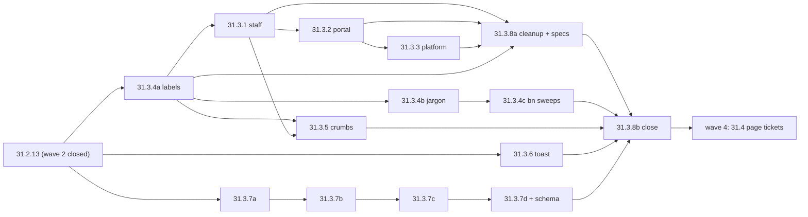
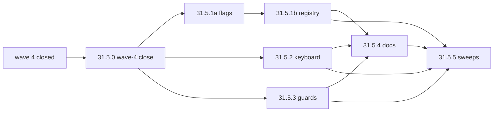

# Epic 31.0 — waves 3 and 5: lanes, order, territory

A **lane** is a queue of tickets run one after another by one agent; lanes in the same wave run in parallel. Two tickets that name the same file under `## Files` are always in the same lane, in the order shown. Checked with a script over every `## Files` path (brace lists expanded): the only shared files are the ones inside one lane (listed per lane).

## Wave 3 — app layouts, wording, shared fixes, server names

| Lane | Tickets, in order | Territory |
|---|---|---|
| shell | 31.3.1 → 31.3.2 → 31.3.3 | `client-admin`: `nav-tree.ts`, `nav-icons.tsx` (new), `nav-not-in-nav.ts`, `route-permissions.ts`, `_staff.tsx`, `portal.tsx`, `_platform/route.tsx`, `staff-user-menu`, `command-palette-launcher`, `e2e/journeys/permissions.spec.ts` |
| locales | 31.3.4a → 31.3.4b → 31.3.4c | `ui/src/i18n/locales/**` only (4b and 4c share 7 bn files: auditLogs, examTemplates, exams, fees, fines, portal, routines) |
| crumbs | 31.3.5 | `client-admin/src/{use-breadcrumbs,route-crumbs}.ts` (+ tests), `ui/src/components/breadcrumbs.*` |
| toast | 31.3.6 | `ui/src/i18n/use-tenant-region-config.ts`, `ui/src/api/query-client.ts` (+ tests) |
| server | 31.3.7a → 31.3.7b → 31.3.7c → 31.3.7d | `server/src/modules/{calendar,admission,audit,exams,seat-plans,routines,homework,invoices,fees/fines,students}/**`, client type mirrors `ui/src/hooks/{exams,seat-plans,routines}.ts`; **31.3.7d alone** regenerates `ui/src/api/schema.d.ts` |
| close | 31.3.8a → 31.3.8b | `ui/src/components/app-shell.*` (legacy props out), shared e2e specs and POMs, full pass, visual check |



Edges outside the lanes: 31.3.4a → 31.3.1, 31.3.2, 31.3.3, 31.3.5, 31.3.8a (keys); 31.3.1 → 31.3.5 (`finance.payments` item, so the payments crumb links); 31.2.9/31.2.10 → 31.3.1–31.3.3; 31.2.1a → 31.3.5; everything in wave 3 → 31.3.8b. Page tickets' "Depends on: 31.3.8" means 31.3.8a + 31.3.8b.

**Watch:** this check covers only the 31.3.* tickets that exist now (all from I-2). If integration agent I-1 adds a wave-3 `ui` ticket that names `ui/src/hooks/exams.ts`, `seat-plans.ts`, `routines.ts` (31.3.7b/c), `ui/src/components/breadcrumbs.*` (31.3.5) or `ui/src/components/app-shell.*` (31.3.8a), it must join that lane (after the named ticket) — re-run the script below after I-1's files land.

## Wave 5 — close-out

| Lane | Tickets, in order | Territory |
|---|---|---|
| wave4-close | 31.5.0 (alone, first) | `e2e/route-manifest.json`, `e2e/responsive/assert.ts`, `e2e/keyboard/organisation-structure.spec.ts`, `results/index.tsx`, student detail `$studentId.tsx` + `fines-tab` + `programs-panel`, `e2e/journeys/fines.spec.ts`; full pass |
| palette | 31.5.1a → 31.5.1b | 10 list-route files (landing flags) + `palette-flags.test.tsx`; `action-registry.ts`, `unregistered-actions.ts` (+ tests), `e2e/keyboard/promotion.spec.ts` |
| keyboard | 31.5.2 | `e2e/keyboard/keyboard-utils.ts` + 8 new `nav-*.spec.ts` |
| guards | 31.5.3 | `ui/eslint-rules/ux-guards.*`, both eslint configs, straggler fixes |
| docs | 31.5.4 | `docs/architecture/{06,09,15}-*.md`, `.claude/skills/redesign-page/{starter.html,SKILL.md,patterns.md}` |
| sweeps | 31.5.5 (last) | `e2e/responsive/{target-size,routes}.ts`, `e2e/a11y/{overlay-openers,routes.a11y.spec}.ts`, `e2e/route-manifest.json` (overlay names only), small shared fixes |

Shared files in wave 5: `e2e/route-manifest.json` (31.5.0 and 31.5.5) — sequential by the edges below (31.5.0 first, 31.5.5 last), never parallel.



Soft edge: 31.5.3's straggler fixes must not edit one of 31.5.1a's 10 route files while 31.5.1a is open — if the first lint run flags one, fix it after 31.5.1a merges (rebase) or allow-list it with a reason.

## Re-run the check

```bash
cd "$PLAN/.." && python3 disjoint.py 31.3. 31.5.   # prints every file named by two tickets of the same wave
```
(`disjoint.py` sits in the scratchpad next to `plan31/`; it reads the `` `path` `` items under each ticket's `## Files`, expanding `{a,b}` lists. Last run: 8 shared paths, all inside one lane as listed above.)
