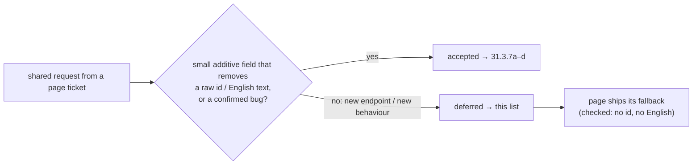

# Epic 31.0 — out of scope (deferred follow-ups)

Real needs found while planning Epic 31.0 that are **new behaviour or a new endpoint**, so D1 ("no new feature") keeps them out. Each page ticket ships a fallback that shows no raw id and no English server text (checked for every row below), so none of these blocks the epic. Each row says what brings it back.

## Server

| # | What | Why deferred | Page fallback (today) | Trigger to bring it back |
|---|---|---|---|---|
| F1 | `GET /staff-attendance/register?date=` + `useStaffAttendanceRegister(date)` so the staff attendance page pre-fills marks already saved (attendance-3) | New endpoint | Every date starts unmarked; saving again overwrites the day | First complaint that re-opening a day loses what was marked, or Epic 36 follow-up work on staff attendance |
| F2 | `GET /leave/requests` so leave can be approved/rejected in the UI (B18) | New endpoint + new screen behaviour | Approvals panel is a plain EmptyState (attendance-3) | Leave approval is asked for, or any payroll epic needs approved leave |
| F3 | Read-only `GET /schools/:id/region` any member may call (31.3.6 `ponytail:`) | New endpoint | Roles without `SETTINGS_MANAGE` use the locale's default numerals/currency instead of the school's own | A school sets non-default numerals or currency and a teacher/accountant/parent sees the default |
| F4 | Stable `error_code` on failed reminder logs (`PROVIDER_NOT_CONFIGURED`, `NO_PROVIDER`, `PROVIDER_REJECTED`…) (communications-3) | New error contract across the worker | Client maps the two known English messages; anything else shows "পাঠানো যায়নি।" | A third provider error shows up, or the provider layer is touched |
| F5 | `details: { code, count }` on class / section delete 409s (classes-1, classes-2) | Error-shape change (follow the repo's 409 `details` rule) | One translated "still has students or sections" sentence, no count | Next change to `classes.service.ts` delete paths |
| F6 | Calendar import preview rows return `name`, `start_date`, `end_date`; errors return a machine `code` (calendar-2) | New DTO fields + error contract in bulk import | Preview shows "সারি n", status and one translated sentence; Name/Dates columns stay out | Next bulk-import change, or users ask to see which event a row is |
| F7 | Exam schedule overlap warnings as data `{ subject_id, starts_at, ends_at }[]` instead of English sentences (exams-2b) | Changes an existing response contract | Schedule tab computes clashes itself from loaded rows | A second client needs clash data, or the server-side rule changes |
| F8 | `exam_name` (and class) on `GET /seat-plans` rows (exams-4a) | Extra information, not a D9 fix | List has no exam column; plans told apart by name | Schools with many plans per term ask to filter/sort by exam |
| F9 | `submitted_by_name` on `GET /exams/:id/marks/...` grid (marks-1) | Extra information, not a D9 fix | "Submitted" card sentence without a name | Marks audit/disputes need "who submitted" on screen |
| F10 | `reviewer_name` on admission evaluations (admissions-2) | Extra information | History shows decision, date-time, note without a reviewer | More than one person reviews applicants at a school |
| F11 | School display name on `GET /public/admission/:slug` (admissions-5) | Extra information on a public endpoint | Public form has no school name subtitle | A parent-facing complaint, or the admission page gets branding |
| F12 | `appliedByName` on `GET /presets/status` (admin-2) | Extra information | Applied summary hides the "applied by" line | Multi-admin schools ask who applied a curriculum |
| F13 | Teacher `user_id` on `SectionTeacherAssignment` so rows link to `/staff/$userId` (staff-3) | New link = new navigation | Rows show name + employee id, no link | Teaching-assignment page gets edit/drill-down work |
| F14 | `GET /users` excludes PARENT/STUDENT members by default (staff-1) | Behaviour change of an existing list | They appear (labelled "কর্মী"); the role filter hides them | Any staff-list work, or a school with many family accounts complains |
| F15 | `full_name` on `GET /acr-assessments` and `GET /incidents` rows (staff-4a) | N+1 fix + search, not a D9 fix | Each row calls `useUser`; no name search on those tabs | The evaluations register gets slow or name search is asked for |

## Client / process

| # | What | Why deferred | Fallback | Trigger |
|---|---|---|---|---|
| F16 | Rule-made fine notes written **before** 31.3.7d stay English ("3 absent days (1 free)") | The note is immutable history; rewriting stored rows is a data migration | New notes are in the school's language (31.3.7d) | A school asks for old fines to read in Bangla |
| F17 | Recurring-fee "bill one-off" form opened from the student page has no URL (`?bill=` on the student route; fees-3b out of scope) | Not filed as a shared request; D22 gap on one secondary entry point | Opens from local state; Back does not close it | 31.5.0-style follow-up when the student fees tab is next touched |

Every accepted request and its foundation ticket is in `PLAN/kit/RESOLUTIONS-app.tsv`.
