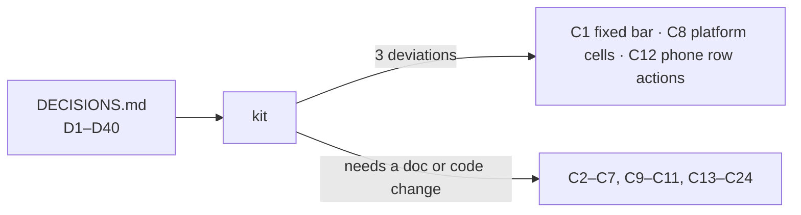

# Conflicts — where a decision meets a doc, the code or the screenshot tool

Each row: what the decision says, what contradicts it (file:line), what the kit shows, and the
resolution the foundation tickets should take. "Doc" = `docs/architecture/09-design-direction.md`
(09) or `15-ux-principles.md` (15). Nothing here was changed silently: the kit follows
`DECISIONS.md` except in **C1**, **C8** and **C12**, where the closest working thing is shown.

## A. The kit deviates from a decision (read these first)

| # | Decision | What goes wrong | What the kit does | Recommended resolution |
|---|---|---|---|---|
| **C1** | D14: bottom bar is `fixed`, the page reserves its height. D22: sticky footer. | `scripts/shoot.mjs:71` takes one `fullPage` frame. A `fixed` or `sticky bottom-0` element is painted at the first viewport's bottom edge — across the middle of every tall phone screenshot, on top of content. Seen in the first gallery shot. | In every starter the bottom bar and the full-page footer are in normal flow, last child of `<body>` (body is `flex min-h-screen flex-col`, so they still sit at the bottom of a short page). Each carries a comment with the app classes. | App: `fixed inset-x-0 bottom-0 z-30` + `pb-16 md:pb-0` on the content wrapper (today it is `sticky`, `ui/src/components/app-shell.tsx:534`); footer `sticky bottom-0`. Mockups: never `fixed` / `sticky bottom-0`. Do not change `shoot.mjs`. |
| **C8** | D14: "4 cells + More" on platform too. | The platform console has two pages (D33; `client-admin/src/routes/_platform/route.tsx` has no nav at all today). There is no fourth destination and D1 forbids inventing one. | `starter-platform.html`: Schools, Holiday sets, Dashboard (back to the school app), More. Three cells. | Accept 3 cells on platform. COMMITTEE has the same shape (Dashboard, Calendar only) — see `nav-icons.md`. Rule: "up to 4 cells, never an empty or duplicate cell". |
| **C12** | D19: row actions are icon buttons with a tooltip. | A phone has no hover, so a tooltip never shows and `hand-coins` alone does not say "collect fee". | Phone cards show the same actions, same icons, same colours, **with the label visible** (`rowLabelled` in the gallery); More stays an icon. Desktop is exactly D19. | Keep. `RowActions` picks the layout from `DataTable`'s card mode; pages pass the same `RowAction[]`. |

## B. A decision contradicts a doc — the doc must be edited

| # | Decision | Contradicts | Recommended resolution |
|---|---|---|---|
| **C2** | Contract: every control ≥ 44 px on phone (also D12, D13). | 09 §6 `:837-838`: staff routes are compact — "Control height … 32 px", "Minimum interactive target 24 px (existing e2e gate)". A staff page on a phone is 32 px today. | Density follows the viewport as well as the shell: below `md` every shell is comfortable. One CSS rule in `globals.css` (`@media (max-width: 47.99rem) { :root { --control-h: 2.75rem; --target-inset: 0.875rem } }`), no prop. Rewrite the §6 table header to "compact = staff at `md` and up". Mockups write `h-11 md:h-8`. `e2e/responsive/target-size.spec.ts` gate moves from 24 to 44 below `md`. |
| **C3** | D17: card padding 16 phone / 20 desktop. | 09 §6 `:840`: "Card padding — 16 px (compact) / 20 px (comfortable)" — tied to density, not width, so a staff desktop card is 16 and a portal phone card is 20. | D17 wins: `p-4 md:p-5` everywhere. Replace the §6 row; D17 says the table is written into 09 as tokens. |
| **C4** | D29: a red **filled** button inside a confirm dialog. | 09 §11 rule 4 `:1204`: "Destructive is never primary. It keeps its tinted fill and coloured label"; `ui/src/primitives/button.tsx:98` is `bg-destructive/10 text-destructive`. | Keep `destructive` (tinted) for inline and menu use. Add one variant, `danger` (`bg-destructive` + foreground token), used only by `ConfirmDialog`. Add a sentence to §11 rule 4: "except the confirm button of a confirm dialog, which is filled". |
| **C5** | D9: never show a UUID. | 15 §5 `:248`: breadcrumbs show "the ID as fallback while loading". | While the entity loads the crumb is a skeleton bar (`h-3 w-24 rounded-sm bg-muted`), and `document.title` uses the parent label. Edit 15 §5. |
| **C6** | D36: one keyboard-journey spec per nav group (8). | 15 §6 `:258`: "Keyboard journey per screen … one per new screen". | D36 wins for this epic (no new screens). Edit the row to "one per nav group; a new screen extends its group's spec". |
| **C7** | D16: breadcrumbs, then the h1; "h1 = last crumb". | 15 U5 `:17` "identical on every screen". On a top-level page the trail is one crumb that repeats the h1 right under it (see `ux-audit/desktop/admin__students.png`: "শিক্ষার্থী" twice). | The breadcrumb row renders only when the trail has ≥ 2 crumbs. Top-level pages start at the h1 (the starter shows this). `document.title` still comes from the trail. |
| **C9** | D19 / contract: tables become cards at `md`. | 09 §13.1 `:1311`: the switch is driven by "measured container width, not a CSS breakpoint". | No change to the component — keep the container query. Mockups use `md:` because they are static; a ticket says "DataTable card mode", never `md:hidden`. |
| **C10** | Kit radius: controls `rounded-md`, cards and dialogs `rounded-lg` (`.claude/skills/redesign-page/SKILL.md:211-213`). | `ui/src/primitives/button.tsx:54` is `rounded-lg`; `ui/src/primitives/dialog.tsx:67` is `rounded-xl`. 09 has no radius rule. | Foundation: buttons, inputs, selects `rounded-md`; cards, popovers, dialogs, sheets `rounded-lg`. Add the two-line rule to 09 next to the spacing tokens. |

## C. A decision contradicts today's component — the foundation ticket must change code

| # | Decision | Code today | Recommended resolution |
|---|---|---|---|
| **C11** | D10: exactly one active sidebar item. | `ui/src/components/app-shell.tsx:212` uses the router's prefix `activeProps`, so `/exams/templates` lights both "Exams" and "Exam templates" (same for `/attendance/*`, `/fees/*`, `/staff/*`, `/routines/*`, `/portal/*`). Active look is `bg-primary/10 … text-primary` + a side bar. | Clone `hasDescendantItem` + `activeOptions.exact` from `bottom-nav.tsx:81`. Active look becomes `bg-secondary font-semibold text-secondary-foreground` (a contrast pair already in `CONTRAST_PAIRS`). Also swap the link's `outline` focus style for the canonical ring (09 §12 `:1269`). |
| **C13** | D17: dialog padding 20 on every side, shared by header / body / footer. | `ui/src/primitives/dialog.tsx:67` `p-4 … gap-4`; footer `:107` is a tinted band `-mx-4 -mb-4 … border-t bg-muted/50 p-4`. | Header `px-5 pt-5`, body `p-5`, footer `px-5 pb-5`, no band, no divider. Keep the footer `sticky bottom-0` (with `bg-surface`) for dialogs taller than the screen. |
| **C14** | D21: sizes 400 / 560 / 720. | Tailwind's named widths skip them (`max-w-md` 448, `max-w-xl` 576, `max-w-2xl` 672). | Spacing-scale classes are exact and not arbitrary: `max-w-100`, `max-w-140`, `max-w-180` (verified: 400 px and 560 px computed). |
| **C15** | D19: default page size 25. | `ui/src/components/data-table.tsx:230` `pageSizeOptions = [10, 20, 50]`; each route passes its own size (`/students` shows 10). | `[25, 50, 100]`; `use-list-shell-state` owns the default (25) so no route passes one. Any persisted `pageSize` not in the list falls back to 25. |
| **C16** | D20: one tab row that scrolls; only the selected panel is in the page. | `ui/src/shells/detail-shell.tsx:197` `flex-wrap` (19 tabs wrap to 2–5 rows); `:211` `forceMount` on visited tabs. | Line variant, `overflow-x-auto`, no wrap, edge fade; drop `forceMount` (keep data warm with the query cache, not the DOM). |
| **C17** | D28 + the "one h1" gate. | `ui/src/components/empty-state.tsx:124` renders the title as `<h1>`; with a `PageHeader` on the page that is two h1s. | Title becomes `<h2>` when inside a page with a header (prop `headingLevel`, default 2); route-level states (404, access denied) keep `<h1>`. The action renders as an outline button. |
| **C18** | D31: badge text colour from a real token. | `ui/src/components/notification-bell.tsx:102` uses `text-destructive-foreground`, which no token defines (`globals.css` has no `--color-destructive-foreground`), on a `size-4` circle with `text-[10px]`. | Add `--color-destructive-foreground` (white in light, `neutral-900` in dark — same values as `--color-primary-foreground`; 6.5:1 on `--color-destructive` in both themes) with a `CONTRAST_PAIRS` row. Mockups use `text-primary-foreground` until it exists. Pill `h-5 min-w-5 px-1 text-caption`. |
| **C19** | D5 / D25: long dates; no typed ISO date; placeholder "তারিখ বাছুন". | `ui/src/utils/date.ts:12` `formatDate` returns `YYYY-MM-DD`; `:36` 24-hour time; `ui/src/components/date-picker.tsx:54` is a text input with placeholder `YYYY-MM-DD`. | Change `formatDate` / `formatDateTime` in place (D5 says "one function each"); add `formatISODate` for exports, URLs and API calls and move those callers. DatePicker trigger becomes a button. Bangla time words need a small table (not `Intl`, which gives "অপরাহ্ণ") — see `patterns.md` §11. |
| **C20** | D8: phones display as `01711-000004`. | `ui/src/utils/phone.ts:39-53` returns `+880 1711-000004` and throws `RangeError` on an invalid number. | Display format = trunk `0` + national number, split 5-6, Latin digits; an invalid value is shown as typed, never thrown. Keep the `+880` form for `tel:` links and SMS. |
| **C21** | D12: phone top bar identical on staff / portal / platform (search, bell, account). D33: same `AppShell`. | `client-admin/src/routes/portal.tsx:44-47` deliberately has no palette and no bell ("neither has a guardian-scoped API"); `_platform/route.tsx:38` is a bare `max-w-6xl` div with no shell. | Portal: palette in its no-people mode (`commandPalette.placeholderNoPeople` already exists) and the bell on the client-side store (D4) — no new API. Platform: wrap in `AppShell`. If the portal palette is judged a new feature (D1), drop only the search button there and record it. |
| **C22** | D34: card `max-w-md`, language switcher top right. | `client-admin/src/routes/-auth-screen.tsx:36` is `max-w-sm`; `:32` also shows a `ThemeToggle`. | `AuthLayout` in `ui`: `max-w-md`; language only (theme follows the system on guest pages). |
| **C23** | D32: one word per thing (`শ্রেণি`, not `ক্লাস`). | `ui/src/i18n/locales/bn/nav.json:54` `"classes": "ক্লাস"` (unused by the sidebar, which reads the entity label, but the calendar filter still says "ক্লাস"). `exam` has no entity label at all (#1221). | Glossary ticket: fix both; the kit already writes `শ্রেণি` and `পরীক্ষা`. |
| **C24** | D18: `cursor: pointer` on anything clickable. | `ui/src/styles/globals.css` has no cursor rule; Tailwind v4's preflight leaves buttons at `cursor: default` (measured in the rendered kit). | Base rule in `globals.css`: `button:not(:disabled), [role="button"], [role="tab"], [role="menuitem"], a[href], summary, label[for] { cursor: pointer }` and `:disabled, [aria-disabled="true"] { cursor: not-allowed }`. |

## D. Smaller notes for implementers

- **Bottom-bar cell.** `ui/src/components/bottom-nav.tsx:56-57` is `min-h-14 … text-xs`, active = `text-primary` only. Kit: `h-16`, tinted pill behind the icon + semibold brand text, label truncates to one line. In dark mode `bg-secondary` equals the bar's ground, so the pill disappears and weight + colour carry the mark — acceptable, noted.
- **Bottom-bar cells per role.** `_staff.tsx:369` passes the same four items to every role; D14 asks per role. `nav-icons.md` has the table, including the three Epic 24 roles the brief did not list.
- **Phone drawer.** `app-shell.tsx:475` is a full-screen dialog whose header scrolls away; D13 wants a start-edge sheet with a sticky header (`PATTERN: NavDrawer`).
- **Tabs primitive.** The pill style (`ui/src/primitives/tabs.tsx`) stays available as `variant="default"` for segmented switches; D20's underline is `variant="line"` and becomes what `DetailShell` uses.
- **`tabular-nums`** does nothing for Bangla digits (09 §13.2); numeric columns still right-align, which is what keeps them readable.
- **Filter chips and other small pills.** The visible pill is 28 px; the button around it is 44 px on phone. This is the one place the target is taller than what you see.
- **Portal title size.** `globals.css` reserves `text-display` for the portal page title; the portal starter uses `text-h1 md:text-display` so a long Bangla title does not wrap on a phone.
- **Gallery only:** `[scrollbar-width:none]` on tab rows is the kit's single arbitrary property (not a px value). The component can use the same declaration in CSS.
- **Raw scale colours.** The app's primary button hovers to `brand-700`; the kit leaves hover out of mockups so no raw scale colour is copied into a ticket.
