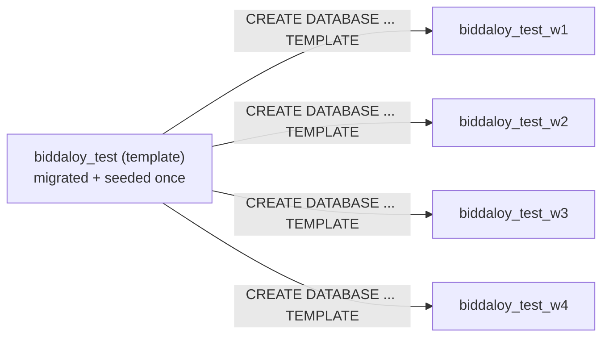

# @biddaloy/server — NestJS Backend

NestJS REST API backend for the school fee management system. PostgreSQL via TypeORM, modular architecture.

## Quick Start

```bash
# From the monorepo root
yarn install
cp .env.example .env          # Then edit with your real credentials
yarn build:shared              # Build shared types package first
yarn dev:server                # Auto-reload on changes
```

The server starts on **http://localhost:3000**. Health check: `GET /api/health`.

## Environment Variables

All env vars are defined in `.env` at the monorepo root. The server loads it via `ConfigModule`.

| Variable | Required | Default | Description |
|----------|----------|---------|-------------|
| `DATABASE_URL` | Yes | — | PostgreSQL connection string |
| `NODE_ENV` | No | `development` | `development` / `production` |
| `PORT` | No | `3000` | Server listen port |
| `JWT_SECRET` | Yes | — | Secret key for JWT tokens |
| `ACCESS_TOKEN_TTL_MS` | No | `900000` (15 min) | Bearer access token lifetime — see root README's "Session & token lifecycle" |
| `REFRESH_TOKEN_TTL_MS` | No | `2592000000` (30 days) | Refresh token (httpOnly cookie) lifetime |
| `SEED_ADMIN_PASSWORD` | For seed | — | Password for the super admin account |
| `DB_SYNCHRONIZE` | No | `false` | TypeORM auto-sync (dev only — set to `true` to enable; never use in prod) |
| `DB_DESTROY_CONFIRM` | For db:clear/db:reset | `false` | Set to `true` to confirm destructive database operations |
| `ENABLE_API_DOCS` | No | unset | Set to exactly `true` to mount `/api/docs` in production (see the root README's "API Documentation" section) |
| `API_DOCS_USER` / `API_DOCS_PASSWORD` | With `ENABLE_API_DOCS=true` in production | — | Basic Auth credentials gating `/api/docs` in production |

## Commands

All commands run via `yarn workspace @biddaloy/server <command>` from the monorepo root.

### Build & Run

| Command | Description |
|---------|-------------|
| `build` | Compile TypeScript to `dist/` using `nest build` |
| `start` | Run compiled output (`node dist/main.js`) |
| `start:dev` | Watch mode with auto-reload (`nest start --watch`) |
| `start:prod` | Production start (same as `start`, use after `build`) |

### Lint & Test

| Command | Description |
|---------|-------------|
| `lint` | Type-check without emitting (`tsc --noEmit`) |
| `test` | Run tests in watch mode (`vitest`) |
| `test:run` | Run tests once (CI mode) |
| `test:unit` | Unit tests only, mocked repositories, no database |
| `test:integration` | Integration specs, real Postgres/Redis |
| `test:e2e` | End-to-end specs, real Postgres/Redis |

### Test databases (parallel workers)

Integration and e2e specs run across up to 4 vitest pool workers at once.
Each worker gets its own Postgres database and Redis db index instead of
sharing one, so they never race each other's `DELETE`s:



- `test/global-setup.ts` migrates and seeds `biddaloy_test` — the value of
  `DATABASE_URL` in `server/.env.test` — once per run, then clones it into
  `biddaloy_test_w1` … `biddaloy_test_w4`.
- `test/setup.ts` reads vitest's own `VITEST_POOL_ID` env var (which worker
  this spec file is running on) and rewrites `DATABASE_URL`/`REDIS_URL` for
  that process to point at `biddaloy_test_w${VITEST_POOL_ID}` and Redis db
  index `${VITEST_POOL_ID}` before any spec file's code runs.
- Nothing to configure by hand — `.env.test` still only needs to name the
  template (`biddaloy_test`), never a worker database directly.

### Database Migrations

| Command | Description |
|---------|-------------|
| `migration:generate <path>` | Generate a migration file from entity changes |
| `migration:run` | Apply all pending migrations |
| `migration:revert` | Roll back the last applied migration |
| `seed` | Create the initial SUPER_ADMIN user (admin@school.com) |
| `db:clear` | **Drop all tables** and custom ENUM types |
| `db:reset` | **One-shot: clear + recreate schema + seed admin** |

### Migration Workflow

```bash
# 1. After editing entities, generate the migration
yarn workspace @biddaloy/server migration:generate src/migrations/YourMigrationName

# 2. Apply it
yarn workspace @biddaloy/server migration:run

# 3. Seed the admin user (first time only)
yarn workspace @biddaloy/server seed

# 4. To start over from scratch
yarn workspace @biddaloy/server db:clear
yarn workspace @biddaloy/server migration:run
yarn workspace @biddaloy/server seed

# Or do it all in one shot (recommended)
yarn workspace @biddaloy/server db:reset
```

**Note:** `migration:generate <path>` requires a path argument — the migration name is the filename, e.g. `src/migrations/CreateUsersTable`.

## Project Structure

```text
server/
├── src/
│   ├── main.ts                  # Entry point
│   ├── app.module.ts            # Root module (imports all feature modules)
│   ├── app.controller.ts        # Root health endpoint
│   ├── data-source.ts           # TypeORM CLI DataSource config (for migrations)
│   ├── config/
│   │   └── env.validation.ts    # Joi/Zod env validation
│   ├── common/
│   │   ├── filters/             # Exception filters
│   │   ├── pipes/               # Validation pipes
│   │   ├── guards/              # Auth guards (future)
│   │   └── decorators/          # Custom decorators (e.g. @SanitizeText)
│   ├── modules/
│   │   ├── users/               # User management
│   │   ├── students/            # Student & guardian records
│   │   ├── academics/           # Teachers, classes, academic years
│   │   ├── fees/                # Fee structures, student fees, payments
│   │   ├── invoices/            # Invoice generation
│   │   ├── communications/      # SMS/email reminders
│   │   ├── audit/               # Audit logging
│   │   └── health/              # Health check endpoint
│   ├── migrations/              # Generated migration files
│   └── scripts/
│       ├── seed.ts              # Super admin seeder
│       └── db-clear.ts          # Drop all tables
├── tsconfig.json
├── vitest.config.ts
└── package.json
```

## Architecture Notes

- **API prefix & versioning**: all routes are under `/api/v1/` (`app.setGlobalPrefix('api')` + URI versioning via `app.enableVersioning()`, see `src/api-versioning.ts`); `/api/health` is version-neutral and stays at that exact path across version bumps. See the root README's "API Versioning" section for the deprecation policy.
- **Validation**: `class-validator` + `ValidationPipe` globally, configured via `buildValidationPipeOptions()` (`src/validation-pipe.ts`) — `whitelist`/`forbidNonWhitelisted`/`transform` are all on, so every DTO field a client sends must be decorated.
- **Sanitization**: free-text fields (names, addresses, notes/remarks — see `@SanitizeText()` in `src/common/decorators/sanitize-text.decorator.ts`) are HTML-stripped on the way **in**, via `class-transformer`'s `@Transform`, using `sanitizeStrict`/`sanitizeAllowlist` from `@biddaloy/shared`. Strip-all is the default policy; every current free-text field uses it. Not sanitized: password fields (bcrypt hashes the raw input); staff-authored message content (reminder `message_template`, `SendCommunicationDto.message_body`) — those interpolate already-sanitized identity data (see `reminder-template.util.ts`) but aren't themselves stripped, since they're authored by staff (a higher trust boundary) and mangling them would corrupt legitimate content (e.g. an intentional `{{placeholder}}`); and the bulk-upload spreadsheet's `class`/`section` columns (`BulkUploadRowDto`) — these are lookup keys matched by exact string against existing `Class.name`/`ClassSection.section_name`, not stored or rendered as free text themselves, so normalizing them here could cause false-negative lookups against a legitimately-named class. Sanitizing on input does not replace output encoding — a field rendered into HTML must still be escaped there for its own context.
- **Error handling**: `AllExceptionsFilter` catches all unhandled errors
- **CORS**: enabled for `localhost:5173` in development only
- **Migrations**: stored in `src/migrations/` as TypeScript files, compiled to `dist/migrations/` on build
- **Data source**: `src/data-source.ts` is for the TypeORM CLI only; the app uses `TypeOrmModule.forRootAsync` in `app.module.ts`