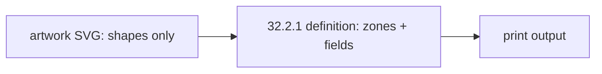

# Suggestion artwork

Sixteen background-only SVG cards (8 designs x front/back) on the CR80 card. 1 user unit = 1 mm.
Portrait 54 x 85.6 mm, landscape 85.6 x 54 mm. Keep essential shapes 3 mm inside the edge (safe zone); artwork may bleed.
Zones are `[x, y, width, height]` in mm and are drawn (or left clear) in the SVGs. They hold no data: fields are placed by the template.

## Student Classic portrait

- Use: student ID card, portrait, formal (deep header band, wave pattern, gold rule, framed photo).
- Palette: primary `#0B3A6B`, secondary `#1B8A8F`, gold `#C9A227`, paper `#FBFDFE`, light `#E6F1F5`.
- Files: `student-portrait-classic-front.svg`, `student-portrait-classic-back.svg`

| Side | Zone | Rect mm |
| --- | --- | --- |
| front | Photo frame | [15, 27, 24, 30] |
| front | Name block | [6, 59, 42, 6.5] |
| front | Class / designation line | [6, 66.5, 42, 4.5] |
| front | Info rows | [6, 72, 42, 10.6] |
| front | Logo circle (cx, cy, r) | (27, 13, 6.5) |
| back | QR square | [12, 14, 30, 30] |
| back | Return-address band | [6, 48, 42, 14] |
| back | Validity band | [6, 64, 42, 8] |

## Student Modern portrait

- Use: student ID card, portrait, clean (diagonal colour block, rounded photo, one accent).
- Palette: primary `#1D5FA8`, secondary `#14A3A0`, accent `#14A3A0`, paper `#FFFFFF`, light `#E9F3F8`.
- Files: `student-portrait-modern-front.svg`, `student-portrait-modern-back.svg`

| Side | Zone | Rect mm |
| --- | --- | --- |
| front | Photo frame | [13, 22, 28, 34] |
| front | Name block | [6, 60, 42, 7] |
| front | Class / designation line | [6, 68, 42, 4.5] |
| front | Info rows | [6, 74.5, 42, 8.1] |
| front | Logo circle (cx, cy, r) | (11, 11, 5.5) |
| back | QR square | [12, 10, 30, 30] |
| back | Return-address band | [6, 43, 42, 15] |
| back | Validity band | [6, 60, 42, 7] |

## Student Classic landscape

- Use: student ID card, landscape, formal (deep header band, wave pattern, gold rule, framed photo).
- Palette: primary `#0B3A6B`, secondary `#1B8A8F`, gold `#C9A227`, paper `#FBFDFE`, light `#E6F1F5`.
- Files: `student-landscape-classic-front.svg`, `student-landscape-classic-back.svg`

| Side | Zone | Rect mm |
| --- | --- | --- |
| front | Photo frame | [6, 20, 22, 28] |
| front | Name block | [33, 21, 47, 7] |
| front | Class / designation line | [33, 29, 47, 5] |
| front | Info rows | [33, 36, 47, 11] |
| front | Logo circle (cx, cy, r) | (12, 7.5, 4.5) |
| front | School-name band | [19, 4, 63, 8] |
| back | QR square | [6, 12, 28, 28] |
| back | Return-address band | [39, 12, 41, 15] |
| back | Validity band | [39, 30, 41, 10] |

## Student Modern landscape

- Use: student ID card, landscape, clean (diagonal colour block, rounded photo, one accent).
- Palette: primary `#1D5FA8`, secondary `#14A3A0`, accent `#14A3A0`, paper `#FFFFFF`, light `#E9F3F8`.
- Files: `student-landscape-modern-front.svg`, `student-landscape-modern-back.svg`

| Side | Zone | Rect mm |
| --- | --- | --- |
| front | Photo frame | [5, 11, 22, 28] |
| front | Name block | [36, 18, 44, 7] |
| front | Class / designation line | [36, 26, 44, 5] |
| front | Info rows | [36, 34, 44, 14] |
| front | Logo circle (cx, cy, r) | (76, 10, 5) |
| back | QR square | [52, 12, 28, 28] |
| back | Return-address band | [17, 12, 30, 15] |
| back | Validity band | [17, 30, 30, 10] |

## Staff Classic portrait

- Use: staff ID card, portrait, formal (deep header band, wave pattern, gold rule, framed photo).
- Palette: primary `#2B2F36`, secondary `#7A1F2B`, gold `#C9A227`, paper `#FCFBFA`, light `#F1ECEA`.
- Files: `staff-portrait-classic-front.svg`, `staff-portrait-classic-back.svg`

| Side | Zone | Rect mm |
| --- | --- | --- |
| front | Photo frame | [15, 27, 24, 30] |
| front | Name block | [6, 59, 42, 6.5] |
| front | Class / designation line | [6, 66.5, 42, 4.5] |
| front | Info rows | [6, 72, 42, 10.6] |
| front | Logo circle (cx, cy, r) | (27, 13, 6.5) |
| back | QR square | [12, 14, 30, 30] |
| back | Return-address band | [6, 48, 42, 14] |
| back | Validity band | [6, 64, 42, 8] |

## Staff Modern portrait

- Use: staff ID card, portrait, clean (diagonal colour block, rounded photo, one accent).
- Palette: primary `#30343B`, secondary `#8E2433`, accent `#8E2433`, paper `#FFFFFF`, light `#F0EDED`.
- Files: `staff-portrait-modern-front.svg`, `staff-portrait-modern-back.svg`

| Side | Zone | Rect mm |
| --- | --- | --- |
| front | Photo frame | [13, 22, 28, 34] |
| front | Name block | [6, 60, 42, 7] |
| front | Class / designation line | [6, 68, 42, 4.5] |
| front | Info rows | [6, 74.5, 42, 8.1] |
| front | Logo circle (cx, cy, r) | (11, 11, 5.5) |
| back | QR square | [12, 10, 30, 30] |
| back | Return-address band | [6, 43, 42, 15] |
| back | Validity band | [6, 60, 42, 7] |

## Staff Classic landscape

- Use: staff ID card, landscape, formal (deep header band, wave pattern, gold rule, framed photo).
- Palette: primary `#2B2F36`, secondary `#7A1F2B`, gold `#C9A227`, paper `#FCFBFA`, light `#F1ECEA`.
- Files: `staff-landscape-classic-front.svg`, `staff-landscape-classic-back.svg`

| Side | Zone | Rect mm |
| --- | --- | --- |
| front | Photo frame | [6, 20, 22, 28] |
| front | Name block | [33, 21, 47, 7] |
| front | Class / designation line | [33, 29, 47, 5] |
| front | Info rows | [33, 36, 47, 11] |
| front | Logo circle (cx, cy, r) | (12, 7.5, 4.5) |
| front | School-name band | [19, 4, 63, 8] |
| back | QR square | [6, 12, 28, 28] |
| back | Return-address band | [39, 12, 41, 15] |
| back | Validity band | [39, 30, 41, 10] |

## Staff Modern landscape

- Use: staff ID card, landscape, clean (diagonal colour block, rounded photo, one accent).
- Palette: primary `#30343B`, secondary `#8E2433`, accent `#8E2433`, paper `#FFFFFF`, light `#F0EDED`.
- Files: `staff-landscape-modern-front.svg`, `staff-landscape-modern-back.svg`

| Side | Zone | Rect mm |
| --- | --- | --- |
| front | Photo frame | [5, 11, 22, 28] |
| front | Name block | [36, 18, 44, 7] |
| front | Class / designation line | [36, 26, 44, 5] |
| front | Info rows | [36, 34, 44, 14] |
| front | Logo circle (cx, cy, r) | (76, 10, 5) |
| back | QR square | [52, 12, 28, 28] |
| back | Return-address band | [17, 12, 30, 15] |
| back | Validity band | [17, 30, 30, 10] |
